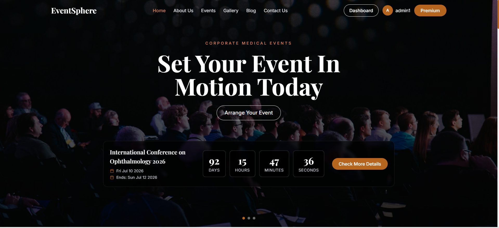
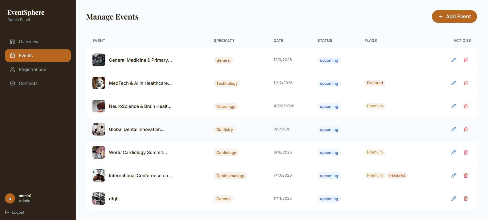
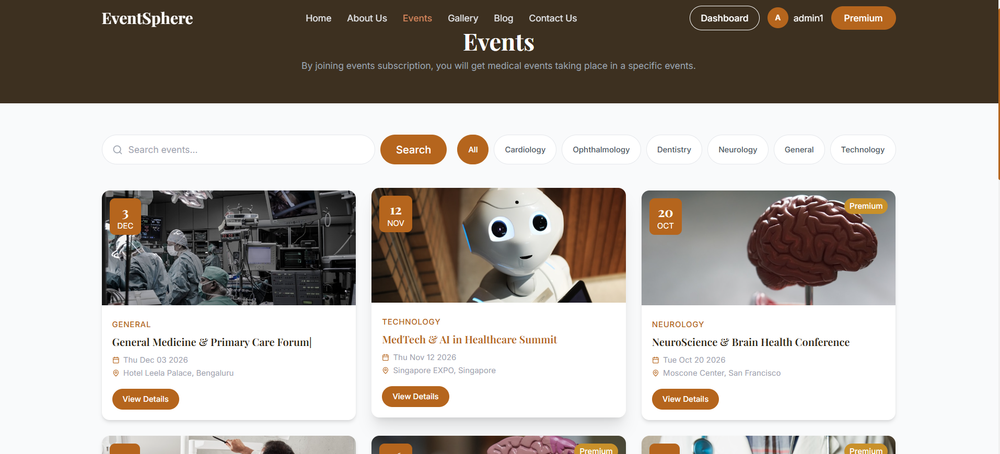

# 🚀 EventSphere — Medical Event Management Platform

A full-stack MERN application to manage and explore medical conferences, premium events, and user registrations.

---

## 🌐 Live Demo

* 🔗https://event-management-sooty-iota.vercel.app

---

## ✨ Features

### 👤 User Features

* User Registration & Login (JWT Authentication)
* Browse medical events
* View premium & featured events
* Save favorite events
* Contact & subscribe

### 👨‍💼 Admin Features

* Admin dashboard
* Create, edit, delete events
* View registrations
* Manage users & contacts

---

## 🛠️ Tech Stack

### Frontend

* React.js (Vite)
* Tailwind CSS
* Axios
* React Router

### Backend

* Node.js
* Express.js
* MongoDB Atlas
* JWT Authentication
* Bcrypt

---

## 📁 Project Structure

```
EVENTSPHERE/
│
├── client/        # Frontend (React)
│   ├── src/
│   └── .env
│
├── server/        # Backend (Node.js)
│   ├── src/
│   └── .env
│
└── README.md
```

---

## ⚙️ Environment Variables

### 📌 Client (.env)

```
VITE_API_URL=https://eventsphere-backend-a1oy.onrender.com/api
```

---

### 📌 Server (.env)

```
PORT=5000
NODE_ENV=production

MONGO_URI=your_mongodb_connection
JWT_SECRET=your_secret_key
JWT_EXPIRES_IN=7d

CLIENT_URL=https://event-management-sooty-iota.vercel.app
```

---

## 🚀 Installation & Setup

### 1️⃣ Clone repo

```
git clone https://github.com/your-username/Event_Management.git
cd Event_Management
```

---

### 2️⃣ Setup Backend

```
cd server
npm install
npm run dev
```

---

### 3️⃣ Setup Frontend

```
cd client
npm install
npm run dev
```

---

## 🌍 Deployment

### Frontend

* Hosted on Vercel

### Backend

* Hosted on Render

### Database

* MongoDB Atlas

---

## 📸 Screenshots

*Add screenshots here*

Example:





---

## 🔐 Authentication

* JWT-based authentication
* Role-based access (User / Admin)

---

## 📌 Future Improvements

* Payment integration
* Image upload (Cloudinary)
* Analytics dashboard
* Notifications system

---


